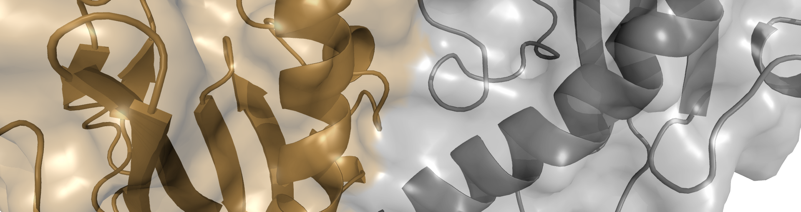
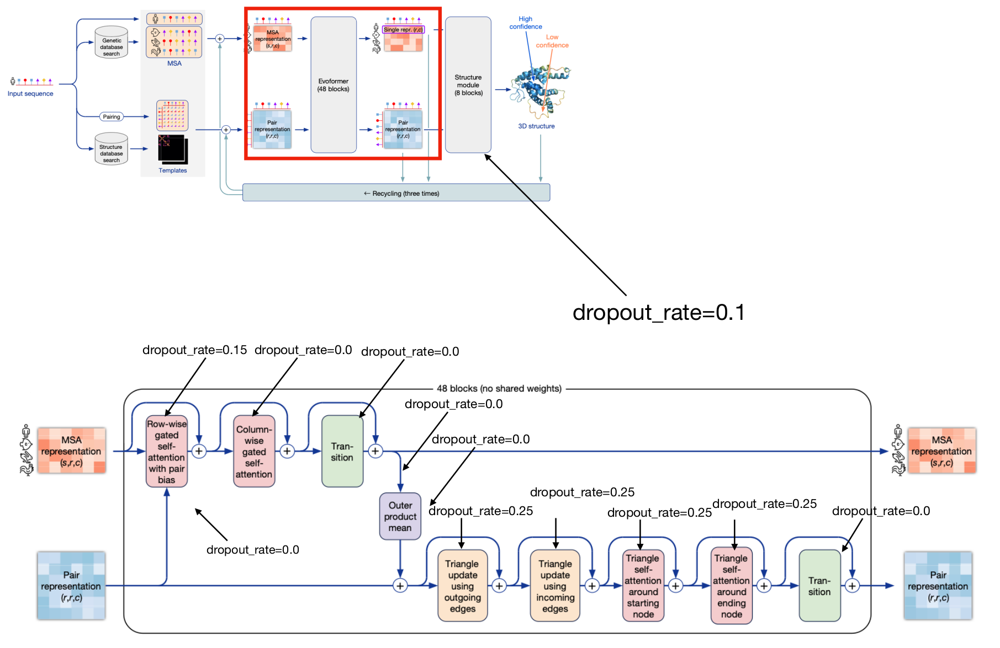

# AFmassive

## Table of contents

<!-- TOC -->
  * [Installation](#installation)
    * [Sequence databases](#sequence-databases)
    * [AlphaFold neural network model parameters](#alphafold-neural-network-model-parameters)
  * [Running AFmassive](#running-afmassive)
    * [New parameters added in AFmassive](#new-parameters-added-in-afmassive)
    * [Dropout](#dropout)
    * [Usage](#usage)
    * [Plots](#plots)
  * [Authors](#authors)
<!-- TOC -->


AFmassive is a modified AlphaFold version that integrates diversity parameters for massive sampling, as a derivative 
version of Björn Wallner's [AFsample](https://github.com/bjornwallner/alphafoldv2.2.0/).  
It was extended from DeepMind's [AlphaFold v2.3.2](https://github.com/deepmind/alphafold).

AFmassive was designed to be optimally used with [MassiveFold](https://github.com/GBLille/MassiveFold) for parallel computing but can also be used outside 
MassiveFold.  
The parameters added to the original DeepMind's AlphaFold are described 
[below](https://github.com/GBLille/AFmassive?tab=readme-ov-file#new-parameters-added-in-afmassive-with-respect-to-alphafold).

## Installation

The setup is the same as the one for AlphaFold v2.3 except that this repository has to be used instead of the DeepMind's one.  
We use an installation based on conda. You can install it using the environment file that we provide (environment.yml).

```
wget https://raw.githubusercontent.com/GBLille/AFmassive/v1.1.4/environment.yml
conda env create -f environment.yml
conda activate AFmassive-1.1.4
wget -O $CONDA_PREFIX/bin/run_AFmassive.py https://raw.githubusercontent.com/GBLille/AFmassive/v1.1.4/run_AFmassive.py
chmod +x $CONDA_PREFIX/bin/run_AFmassive.py
wget -O ${CONDA_PREFIX}/lib/python3.10/site-packages/alphafold/common/stereo_chemical_props.txt https://git.scicore.unibas.ch/schwede/openstructure/-/raw/7102c63615b64735c4941278d92b554ec94415f8/modules/mol/alg/src/stereo_chemical_props.txt
```

***N.B.***: in function of your infrastructure, you may need to install [cuda-nvcc](https://anaconda.org/nvidia/cuda-nvcc) 
in your conda environment.

### Sequence databases

AFmassive requires the installation of the sequence databases which are provided by [DeepMind's AlphaFold2](https://github.com/google-deepmind/alphafold/). 

The script `scripts/download_all_data.sh` can be used to download and set up all the databases:

Recommended default:

```bash
scripts/download_all_data.sh <DOWNLOAD_DIR>
```

For more details, read the documentation provided by [AlphaFold2](https://github.com/google-deepmind/alphafold/#genetic-databases). 

### AlphaFold neural network model parameters

AFmassive uses several neural network (NN) model parameters provided by different versions of [AlphaFold2](https://github.com/google-deepmind/alphafold/) including versions `2.1`, `2.2` and `2.3`.  
If you have already installed the sequence databases for [AlphaFold2 2.3.2](https://github.com/google-deepmind/alphafold/), then you have to copy the v1 and v2 neural network (NN) model parameters in the `<DOWNLOAD_DIR>/params` folder created 
during the installation of the databases.

Parameters for monomer and multimer v1 (used by AlphaFold [v2.1.0](https://github.com/google-deepmind/alphafold/tree/v2.1.0), 
[v2.1.1](https://github.com/google-deepmind/alphafold/tree/v2.1.1), [v2.1.2](https://github.com/google-deepmind/alphafold/tree/v2.1.2)) 
are available here: https://storage.googleapis.com/alphafold/alphafold_params_2021-10-27.tar

```bash
ALPHAFOLD_PARAMS="alphafold_params_2021-10-27.tar"
wget https://storage.googleapis.com/alphafold/${ALPHAFOLD_PARAMS}
tar xf ${ALPHAFOLD_PARAMS} -C <DOWNLOAD_DIR>/params`
```

After downloading them, rename all the files for the multimer model to add the `_v1` suffix.
To do it, you may use this code:

```bash
for model in $(seq 5); do
  mv params_model_${model}_multimer.npz params_model_${model}_multimer_v1.npz
done
```

Parameters for monomer and multimer v2 (used by AlphaFold [v2.2.0](https://github.com/google-deepmind/alphafold/tree/v2.2.0), 
[v2.2.1](https://github.com/google-deepmind/alphafold/tree/v2.2.1), [v2.2.2](https://github.com/google-deepmind/alphafold/tree/v2.2.2), 
[v2.2.3](https://github.com/google-deepmind/alphafold/tree/v2.2.3), [v2.2.4](https://github.com/google-deepmind/alphafold/tree/v2.2.4)) 
are available here: https://storage.googleapis.com/alphafold/alphafold_params_2022-03-02.tar

```bash
ALPHAFOLD_PARAMS="alphafold_params_2022-03-02.tar"
wget https://storage.googleapis.com/alphafold/${ALPHAFOLD_PARAMS}
tar xf ${ALPHAFOLD_PARAMS} -C <DOWNLOAD_DIR>/params`
```

Parameters for monomer and multimer v3 (used by AlphaFold [v2.3.0](https://github.com/google-deepmind/alphafold/tree/v2.3.0), 
[v2.3.1](https://github.com/google-deepmind/alphafold/tree/v2.3.1), 
[v2.3.2](https://github.com/google-deepmind/alphafold/tree/v2.3.2)) 
are available here: https://storage.googleapis.com/alphafold/alphafold_params_2022-12-06.tar

```bash
ALPHAFOLD_PARAMS="alphafold_params_2022-12-06.tar"
wget https://storage.googleapis.com/alphafold/${ALPHAFOLD_PARAMS}
tar xf ${ALPHAFOLD_PARAMS} -C <DOWNLOAD_DIR>/params`
```

*N.B.*: the NN parameters for monomers are present in the three tarball archives but the three sets are the same. Only the NN for multimers have three different versions. It makes 5 NN models for monomers and 15 for multimers.

Once the installation completed, the list of NN model parameters in the `<DOWNLOAD_DIR>/params` folder should be as follows:

```
params_model_1_multimer_v1.npz  
params_model_1_multimer_v2.npz  
params_model_1_multimer_v3.npz  
params_model_1.npz  
params_model_1_ptm.npz  
params_model_2_multimer_v1.npz  
params_model_2_multimer_v2.npz  
params_model_2_multimer_v3.npz  
params_model_2.npz  
params_model_2_ptm.npz  
params_model_3_multimer_v1.npz  
params_model_3_multimer_v2.npz  
params_model_3_multimer_v3.npz  
params_model_3.npz  
params_model_3_ptm.npz  
params_model_4_multimer_v1.npz  
params_model_4_multimer_v2.npz  
params_model_4_multimer_v3.npz  
params_model_4.npz  
params_model_4_ptm.npz  
params_model_5_multimer_v1.npz  
params_model_5_multimer_v2.npz  
params_model_5_multimer_v3.npz  
params_model_5.npz  
params_model_5_ptm.npz  
```

## Running AFmassive

### New parameters added in AFmassive

This is AFmassive parameters list added to AlphaFold 2.3.2 and their description, also accessible through the `--help` option (`--help` also shows native AlphaFold2 parameters).

  **--alignments_only**: whether to generate only alignments. Only alignments will be generated by the data pipeline,  
  &nbsp;&nbsp;&nbsp;&nbsp; the structure inference will not be performed (default: 'false')  
  **--dropout**: turn on drop out during inference to get more diversity (default: 'false')  
  **--dropout_structure_module**: activates dropout or not during inference in the structure module (default: 'false')  
  **--dropout_rates_filename**: provides dropout rates at inference from a JSON file.  
  &nbsp;&nbsp;&nbsp;&nbsp; If None, default rates are used, if "dropout" is True.  
  **--max_recycles**: maximum number of recycles to run for multimer (default: '20')  
  **--early_stop_tolerance**: early stop threshold for recycling (default: '0.5')  
  **--bfd_max_hits**: max hits in BFD/uniref MSA (default: '100000')  
  **--mgnify_max_hits**: max hits in mgnify MSA (default: '501')  
  **--uniprot_max_hits**: max hits in uniprot MSA (default: '50000')  
  **--uniref_max_hits**: max hits in uniref MSA (default: '10000')  
  **--model_preset**: <monomer|monomer_casp14|monomer_ptm|multimer>:  
  &nbsp;&nbsp;&nbsp;&nbsp; choose preset model configuration - monomer model, monomer model with extra ensembling,  
  &nbsp;&nbsp;&nbsp;&nbsp; monomer model with pTM head, or multimer model; "multimer" computes the 3 versions of  
  &nbsp;&nbsp;&nbsp;&nbsp; multimer models by default if models are not specified in the *--models_to_use* parameter  
  &nbsp;&nbsp;&nbsp;&nbsp; (default: 'monomer')  
  **--models_to_use**: specify which neural network models in *--model_preset* that should be run,  
  &nbsp;&nbsp;&nbsp;&nbsp; each model should be formated, for monomer and monomer_casp14 as model_X, with X the number  
  &nbsp;&nbsp;&nbsp;&nbsp; of the model, for monomer_ptm as model_X_ptm, with X the number of the model, for multimer as  
  &nbsp;&nbsp;&nbsp;&nbsp; model_X_multimer_vY with X the number of the model and Y the version of the model.  
  &nbsp;&nbsp;&nbsp;&nbsp; (a comma separated list)  
  **--start_prediction**: prediction to start with, can be used to parallelize jobs; is combined with --end_prediction  
  &nbsp;&nbsp;&nbsp;&nbsp; *e.g.* --start_prediction 20 --end_prediction 20 will only make prediction _20  
  &nbsp;&nbsp;&nbsp;&nbsp; *e.g.* --start_prediction 20 --end_prediction 21 will make prediction _20 and _21 *etc.*  
  &nbsp;&nbsp;&nbsp;&nbsp; (default: '1')  
  **--end_prediction**: prediction to end with, can be used to parallelize jobs, is combined with --start_prediction    
  &nbsp;&nbsp;&nbsp;&nbsp; *e.g.* --start_prediction 20 --end_prediction 20 will only make prediction _20    
  &nbsp;&nbsp;&nbsp;&nbsp; *e.g.* --start_prediction 20 --end_prediction 21 will make prediction _20 and _21 *etc.*    
  &nbsp;&nbsp;&nbsp;&nbsp; (default: '5')  
  **--templates**: whether to use templates or not, setting it to false is faster than filtering by date  
  &nbsp;&nbsp;&nbsp;&nbsp; (default: 'true')  
  **--stop_recycling_below**: after the first recycle step, only predictions with ranking confidence above this score  
  &nbsp;&nbsp;&nbsp;&nbsp; will continue recycling; predictions below this threshold will still be present in 
  &nbsp;&nbsp;&nbsp;&nbsp; ranking_debug.json and produce output. (default: '0')  
  **--min_score**: predictions with a score below this threshold will be excluded from the output (default: '0.0')  
  **--max_score**: terminates the computing process when a suitable prediction with a ranking confidence > max_score  
  &nbsp;&nbsp;&nbsp;&nbsp; has been obtained (default: '1')  
  **--keep_pkl**: Whether to output pkl files or not. (default: 'true')  

### Dropout

The dropout at inference can be activated with the `--dropout` parameter set to true to activate it or not.  
If `--dropout_structure_module` is set to true, the dropout is also activated in the structure module. If not, it is only activated in the Evoformer module.  
The same dropout rates as those used by DeepMind at training are used by default.
The following figure depicts DeepMind's architectural details (Jumper J et al, Nature, 2021 - Fig 3.a), 
annotated by Björn Wallner for [CASP15](https://predictioncenter.org/), showing the various dropout rates (red frame 
detailed just below):  



These rates can be modified also by using the `--dropout_rates_filename` parameter. 
The parameter takes a path to a json file. This is an example of what it should contain:
```json
{  
    "dropout_rate_msa_row_attention_with_pair_bias": 0.15,  
    "dropout_rate_msa_column_attention": 0.0,  
    "dropout_rate_msa_transition": 0.0,  
    "dropout_rate_outer_product_mean": 0.0,  
    "dropout_rate_triangle_attention_starting_node": 0.25,  
    "dropout_rate_triangle_attention_ending_node": 0.25,  
    "dropout_rate_triangle_multiplication_outgoing": 0.25,  
    "dropout_rate_triangle_multiplication_incoming": 0.25,  
    "dropout_rate_pair_transition": 0.0,  
    "dropout_rate_structure_module": 0.1  
}  
```

### Usage
By default, AFmassive runs with the same parameters as AlphaFold2, except it doesn't use only the NN model parameters 
of the last version but uses all the versions for multimers.  

Here is an example how to run a multimer prediction with all the versions of neural network model parameters, without 
templates, activating dropout at inference in both Evoformer and structure module, with 20 recycles maximum and early 
stop tolerance set to 0.5 Angströms. 

```bash
run_AFmassive.py
    --fasta_paths=seq.fasta \
    --output_dir=./output \
    --data_dir=*path_to_set* \
    --db_preset=full_dbs \
    --max_template_date=2024-01-01 \
    --use_precomputed_msas=false \
    --models_to_relax=best \
    --use_gpu_relax=true \
    --alignments_only=false \
    --dropout=true \
    --dropout_structure_module=true \
    --dropout_rates_filename= \
    --max_recycles=20 \
    --early_stop_tolerance=0.5 \
    --bfd_max_hits=100000 \
    --mgnify_max_hits=501 \
    --uniprot_max_hits=50000 \
    --uniref_max_hits=10000 \
    --model_preset=multimer \
    --models_to_use= \
    --start_prediction=1 \
    --end_prediction=5 \
    --templates=false \
    --stop_recycling_below=0 \
    --min_score=0 \
    --max_score=1 \
    --keep_pkl=true \
    --uniref90_database_path=*path_to_set* \
    --mgnify_database_path=*path_to_set* \
    --template_mmcif_dir=*path_to_set* \
    --obsolete_pdbs_path=*path_to_set* \
    --bfd_database_path=*path_to_set* \
    --pdb_seqres_database_path=*path_to_set* \
    --uniref30_database_path=*path_to_set* \
    --uniprot_database_path=*path_to_set*
```

To select which NN models are used, separate them with a comma in the `--models_to_use` parameter, *e.g.*:  
`--models_to_use=model_3_multimer_v1,model_3_multimer_v3`  

### Plots
To plot prediction quality graphs, you can use the [massivefold_plots.py](https://github.com/GBLille/MassiveFold/tree/v1.2.3/massivefold) 
script, which is directly included in [MassiveFold](https://github.com/GBLille/MassiveFold).

***N.B***: if the `--keep_pkl` is set to `false`, some plots can't be produced because they rely on the data included in 
the *pkl* files.

## Authors
Nessim Raouraoua (UGSF - UMR 8576, France)  
Claudio Mirabello (NBIS, Sweden)  
Christophe Blanchet (IFB, France)  
Björn Wallner (Linköping University, Sweden)  
Marc F Lensink (UGSF - UMR8576, France)  
Guillaume Brysbaert (UGSF - UMR 8576, France)  

This work was carried out as part of Work Package 4 of the [MUDIS4LS project](https://www.france-bioinformatique.fr/actualites/mudis4ls-le-projet-despaces-numeriques-mutualises-pour-les-sciences-du-vivant/) 
led by the French Bioinformatics Institute ([IFB](https://www.france-bioinformatique.fr/)). It was initiated at the 
[IDRIS Open Hackathon](http://www.idris.fr/annonces/idris-gpu-hackathon-2023.html), part of the Open Hackathons program. 
The authors would like to acknowledge OpenACC-Standard.org for their support.
